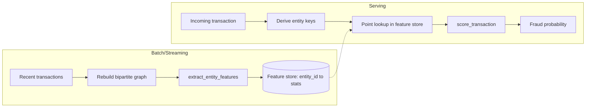

# Production Scaling

This project stops at modeling and monitoring — this document covers how
the pieces here would extend into a real-time serving system, without
building that system.

## Serving interface

`src/sentrynet/modeling/scoring.py`'s `score_transaction()` is the call a
real-time payment flow would make: given one raw transaction, it returns a
fraud probability. It takes an `entity_lookup` callable and never touches
the graph directly — that split exists specifically to make explicit that
serving and graph computation are different systems.

## The graph-feature serving problem

Graph features (degree, component size, community id, clustering
coefficient — see `src/sentrynet/graph/features.py`) are properties of the
*whole graph*, not computable from one incoming transaction. Recomputing
community detection per request is incompatible with a payment-flow
latency SLA.

The resolution is to decouple computation from serving:

- **Batch/streaming side**: the graph is rebuilt on a cadence (hourly/daily
  batch, or incremental streaming) and its output is a lookup table —
  `entity_id -> {degree, component_size, community_id, clustering_coeff,
  last_updated}` — one row per device-fingerprint or card-entity, not per
  transaction.
- **Serving side**: `score_transaction()` derives the same entity keys used
  at training time (`build_device_fingerprints`, `build_card_entity_ids`)
  from the incoming transaction, then does an O(1) point lookup (e.g. a
  Redis `GET`) against that table — no traversal.
- **Staleness is inherent, not a bug**: graph features are always at least
  one batch-cycle old. A fraud ring formed in the last few minutes won't
  show elevated degree/component-size yet. This is why graph features are
  one signal among several — velocity features (`src/sentrynet/features/velocity.py`)
  can be computed closer to real-time from a shorter-lived cache — rather
  than the sole defense.
- **Cold start**: an entity never seen before has no store entry.
  `score_transaction()` falls back to `DEFAULT_ENTITY_FEATURE_FALLBACK` and
  sets `is_new_entity=True`, since "never seen before" is itself mildly
  informative for fraud, rather than silently imputing a value that looks
  like an established, low-risk entity.

## Feature store choice

Velocity-style features need low-latency reads of recent aggregates keyed
by card/device. A feature store (e.g. Feast backed by Redis) fits this: an
offline store for training-time feature generation, an online store for
millisecond-latency lookups at serving time, and a single feature
definition shared between both so training/serving skew is avoided.

## Inference latency

Raw XGBoost inference is already fast, but under a strict payment-flow SLA
(sub-50ms end-to-end, of which model inference is only one part), exporting
to ONNX Runtime is worth considering — it removes Python-interpreter
overhead per request and standardizes the runtime across model versions.
The tradeoff is an added conversion/validation step in the deployment
pipeline to confirm ONNX and native predictions stay numerically
equivalent.
